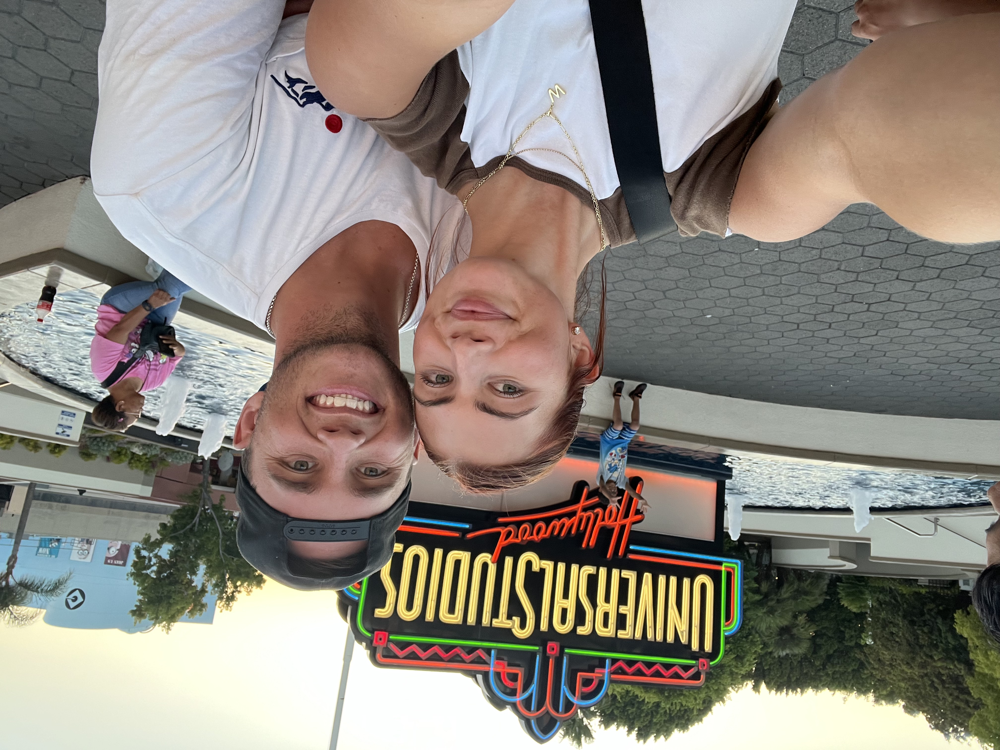

::: {.hero-banner .text-center}

<h1>Wyatt Wolfgramm</h1>
<h2>Product Builder &middot; BYU Marriott School of Business</h2>

<a href="https://www.linkedin.com/in/wyatt-wolfgramm" class="btn btn-outline-primary btn-sm" target="_blank">
  <i class="fab fa-linkedin"></i> LinkedIn
</a>
<a href="https://github.com/wyatt-44" class="btn btn-outline-primary btn-sm" target="_blank">
  <i class="fab fa-github"></i> GitHub
</a>

:::

## Featured Projects

::: {.g-col-12 .g-col-md-6 .card}

### [Sprint 3: MVPVU Highlights Platform](projects/project-3.qmd)
A full-stack web app with Supabase auth, database persistence, and RLS — enabling families to watch youth sports games, clip highlights, and share them securely.

:::

::: {.g-col-12 .g-col-md-6 .card}

### [Sprint 1: MVPVU Camera Scheduler](projects/project-1.qmd)
A dashboard prototype for visual management of camera assignments across multiple sports venues, featuring conflict detection and battery monitoring.

:::
